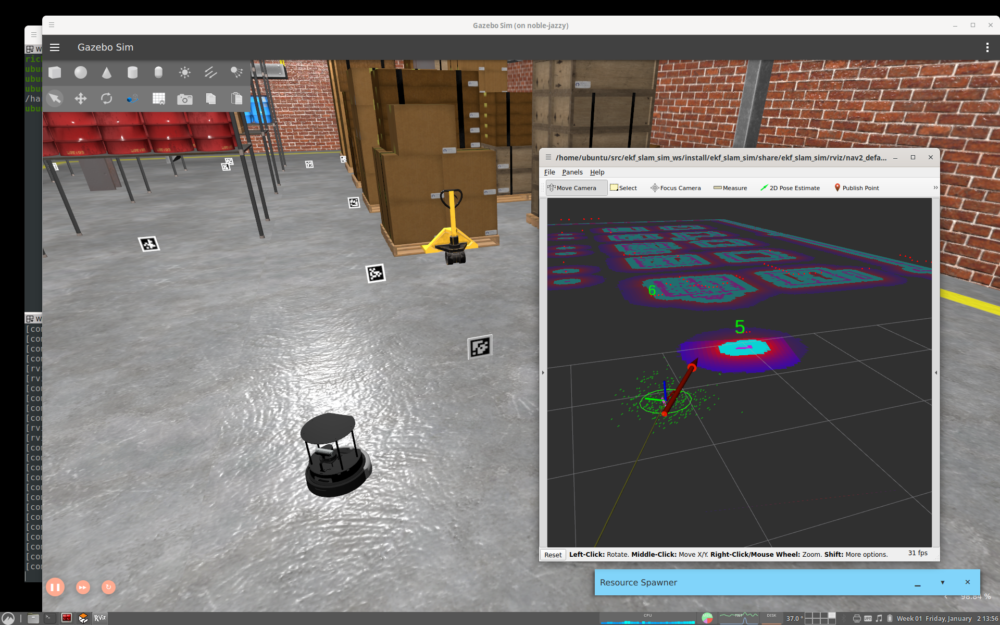

# ekf_slam_sim

ROS package with launch files and code to demonstrate landmark-based EKF SLAM 
on a simulated Turtlebot 4 in Gazebo.
Borrows heavily from the excellent `robot_localization` [package](https://github.com/cra-ros-pkg/robot_localization).
